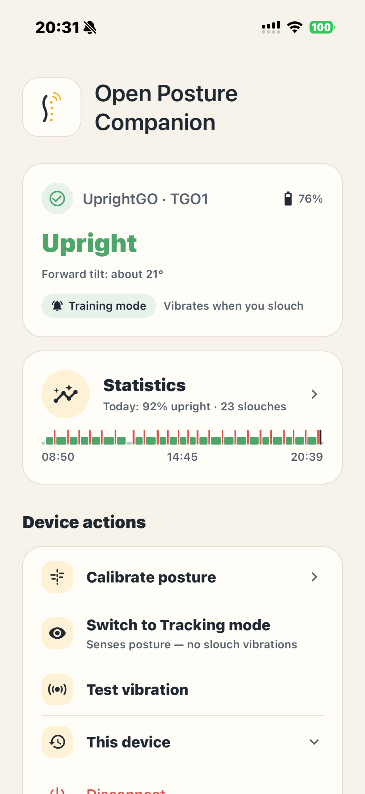
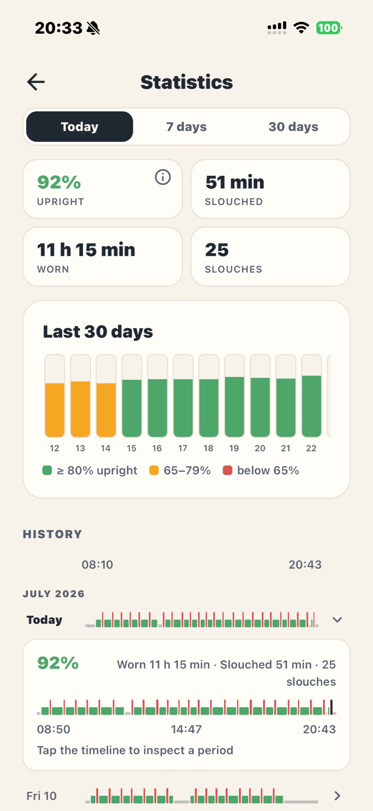
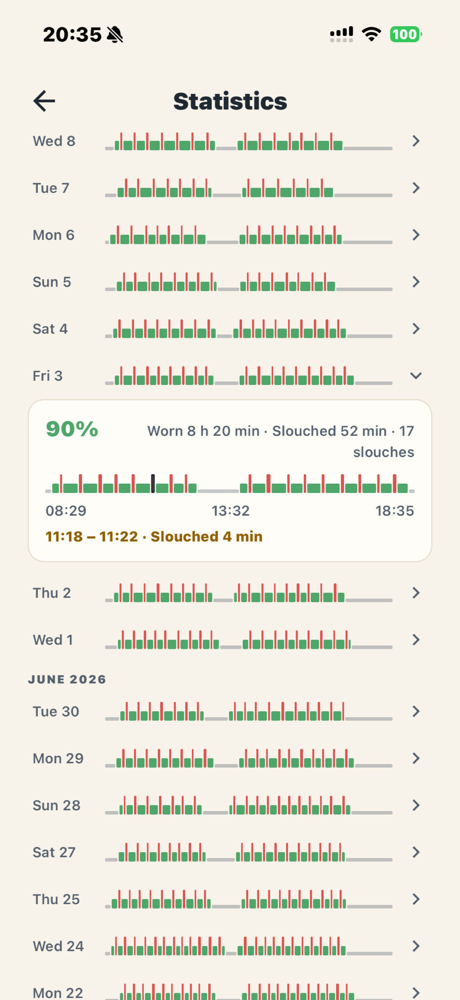

# Open Posture Companion

An independent, open-source companion app for the discontinued **Upright GO 1** posture trainer. The official app is gone; the hardware still works. This project keeps it useful on modern phones.

Built with Expo (SDK 55) and React Native, on top of a community [reverse-engineered BLE protocol](https://github.com/niltonheck/upright-go-1-reverse-engineering).

> This is an independent open-source interoperability project. It is not affiliated with, endorsed by, sponsored by, or approved by UPRIGHT or any related company. "Upright GO" is used only to identify compatibility with original Upright GO 1 hardware. **This app is not a medical device.**

<p align="center">
  
  
  
</p>

## What it does

The app is deliberately a *companion*, not a wellness dashboard: connect to the device, keep it calibrated, and quietly gather posture data on-device.

**Device control**

- **Scan & connect** — finds nearby devices advertising as `UprightGO`, with plain-language signal strength (Strong / Medium / Weak). Remembers your device and reconnects directly on launch; identically-named units are told apart by a short device code and a "Last used" badge.
- **Guided calibration** — set your upright reference posture. The app reads the device's stored calibration record and adopts it on connect, so an already-calibrated device just works; a device that connects uncalibrated (which happens after every power-off) is offered the calibration step right away — skippable, never forced.
- **Training / Tracking modes** — toggle between Training (slouch vibrations on) and Tracking (device senses only), mirroring the hardware button.
- **Test vibration** — one-tap sanity check that the link works.

**Live status**

- Upright / Slouching indicator fed by real-time device notifications, plus a live forward-tilt angle readout.
- Device vitals: battery percentage, charging state, and whether the device is currently worn.
- Auto-reconnect with exponential backoff on unexpected drops.

**Posture statistics (on-device only)**

- **Statistics screen** — today, rolling 7 days, or 30 days at a glance: upright %, slouched time, worn time, and slouch counts, plus a color-graded 30-day chart of daily upright %.
- **Day-by-day history** — every recorded day expands into a minute-resolution timeline; tap any segment for the exact period ("11:18 – 11:22 · Slouched 4 min"). History is kept for 30 days, then pruned.
- **Background monitoring (iOS)** — the app keeps gathering the ~1/min telemetry while backgrounded or the phone is locked, with CoreBluetooth state restoration so iOS can resurrect the connection after an eviction. The chatty tilt stream stays foreground-only to bound battery cost (see ADR-008).
- Device odometer: lifetime usage minutes and connection count decoded from the device.

**Demo mode** — five taps on the About screen's version line surface a simulated device that drives the entire pipeline (live status, calibration, stats, a 30-day history) with realistic data. Built for App Store review, equally useful for developing without hardware; simulated data never touches real history.

**Privacy-first by construction**: no accounts, no cloud sync, no analytics. All data stays on the phone (`expo-sqlite` key-value storage) and self-prunes after 30 days — see [PRIVACY.md](PRIVACY.md).

## Architecture

Four layers, each talking only to the one below it:

```
UI layer          src/app/         Expo Router screens (single stack flow, no tabs)
      ↓ uses hooks only
Hook/state layer  src/hooks/       useDevice, usePosture, useTilt, useVitals, useSessionStats
      ↓ calls methods on
Device layer      src/device/      UprightGoDevice class — the core of the app
      ↓ raw BLE via
Transport layer   react-native-ble-plx (BleManager)
```

The **device abstraction layer** is the load-bearing piece: no GATT UUID, raw byte value, or BLE call ever leaks above it. All protocol constants live in `src/device/characteristics.ts` and are never imported outside `src/device/`. Screens and hooks operate on typed domain values (`PostureStatus`, `ConnectionState`), so protocol corrections touch one module.

Other structural points:

- **Explicit connection state machine** (`idle → scanning → connecting → connected → reconnecting → disconnected`, plus permission/error states) instead of ad-hoc booleans — BLE on mobile is fragile and the UI reflects every state honestly.
- **Tiered subscriptions**: the high-frequency tilt stream runs only in the foreground; backgrounded, the app listens to the once-a-minute telemetry tick and rare vitals notifications.
- **Persistence stays out of the device layer** — only hooks touch `src/storage/`.

The complete hardware-verified BLE protocol reference (GATT map, byte formats, decode notes) lives in the [reverse-engineering repo](https://github.com/niltonheck/upright-go-1-reverse-engineering).

## Main design decisions

| ADR | Decision |
|---|---|
| 001 | `react-native-ble-plx` for BLE — first-class Expo config plugin; requires a custom dev client (no Expo Go) |
| 002 | Device abstraction layer over raw GATT — UUIDs and byte literals never leave `src/device/` |
| 003 | Linux for daily development; a Mac only for native iOS builds |
| 004 | `neverForLocation` declared for Android BLE scanning — no confusing location prompt |
| 005 | `aab1` is the calibration characteristic (hardware-verified; upstream sample's `aaa6` was a typo) |
| 006 | **Firmware operations are permanently out of scope** — the device accepts unchecked firmware writes and has been bricked this way; the hardware is irreplaceable |
| 007 | Minimal V0 scope: one stack flow, two device actions, one live status line — no dashboards, scores, or settings |
| 008 | iOS background BLE monitoring: GO — foreground-only stats defeat the product; tiered fidelity bounds the battery cost |

Product-level principles:

- **Trademark-safe identity** — "Upright GO" appears only as compatibility text, never as the product identity. Third-party hardware is depicted only as original line illustrations, never photos or vendor assets.
- **Non-medical language everywhere** — posture *reminders*, never treatment or correction claims.
- **Protocol findings flow upstream** — decodes made while building this app are contributed back to the reverse-engineering repo.

## Getting started

Because the app uses native BLE, it **cannot run in Expo Go** — you need a custom dev client on a physical device (BLE also rules out simulators for anything real).

```bash
npm install

# Build and install the dev client (requires Xcode on macOS / Android SDK)
npx expo run:ios      # or: npx expo run:android
# — or use EAS Build (eas.json is configured)

# Day-to-day development: just the bundler
npx expo start
```

Once the dev client is installed, JS iteration only needs `expo start` — the phone connects to Metro over LAN, so daily development works fine from a machine that can't build iOS (ADR-003).

**No hardware? Use demo mode.** In the app: About → tap the version line five times → scan → connect to the simulated device. The whole BLE pipeline runs against a scripted transport, so every screen has realistic data to develop against.

**Status:** iOS is the validated platform; Android configuration is in place but on-device verification is pending.

## Contributing

Contributions are welcome — this project exists so owners of discontinued hardware aren't stranded.

**Where to start**

- Check the open issues — protocol questions, Android verification, and roadmap items are tracked there.
- Protocol discoveries belong upstream in the [reverse-engineering repo](https://github.com/niltonheck/upright-go-1-reverse-engineering) as well as here.

**Ground rules**

1. **Never touch firmware characteristics** (ADR-006). This is a hard constraint — no exceptions, no "read-only experiments" against firmware endpoints.
2. **Respect the layering** (ADR-002): GATT UUIDs and command bytes only in `src/device/characteristics.ts`; screens use hooks, hooks use the device layer.
3. **Follow the design system**: every color goes through `Palette` (`src/constants/palette.ts`), every text metric through `Type` (`src/constants/typography.ts`) — no hex literals or ad-hoc font sizes in screens.
4. **Keep the copy safe**: plain, non-medical language — posture *reminders*, never correction or treatment claims. The "not a medical device" disclaimer is mandatory on user-facing surfaces.
5. **Stay lean**: V0's non-goals (no accounts, no cloud, no gamification, data stays on-device) are product decisions, not gaps. Propose scope changes in an issue before building.
6. Run `npm run lint` before submitting.

## License & disclaimer

Released under the [MIT License](LICENSE).

This is an independent open-source interoperability project. It is not affiliated with, endorsed by, sponsored by, or approved by UPRIGHT or any related company. "Upright GO" is used only to identify compatibility with original Upright GO 1 hardware.

This app is not a medical device. Features are posture reminders and vibration feedback, not medical treatment.
